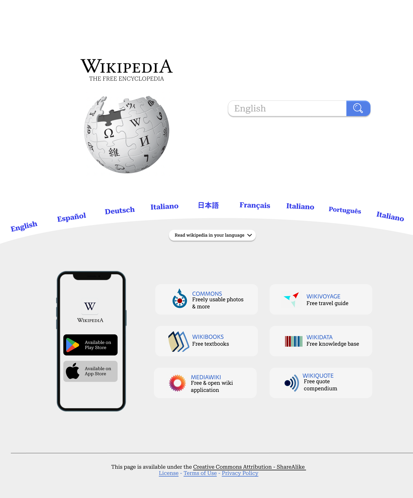

# Wikipedia Redesign for Apogee Hackathon

This project is a redesign of the Wikipedia website for the Apogee Hackathon. The goal of this project is to improve the user experience and overall design of the Wikipedia website while maintaining its core functionalities.

# Features

The redesigned Wikipedia website includes the following features:

-   Modern and sleek user interface with updated color scheme
-   Simplified navigation and improved search functionality
-   Improved readability with larger fonts and increased line spacing
-   Dark mode option for comfortable reading in low-light environments
-   Mobile responsiveness for seamless browsing on all devices

# Technologies Used

The redesigned Wikipedia website was built using the following technologies:

-   HTML and CSS for the structure and styling of the website
-   JavaScript for dynamic elements and user interactions
-   Bulma.io CSS framework for responsive design and pre-built UI components

Screenshots
Here are some screenshots of the redesigned Wikipedia website:

# How to Use

To use the redesigned Wikipedia website, simply visit the website URL in your web browser. The website is designed to be intuitive and easy to navigate, with all the core functionalities of the original Wikipedia website. The dark mode option can be enabled or disabled by clicking the toggle button in the top right corner of the website.

# Conclusion

The Wikipedia redesign project for Apogee Hackathon is a great example of how a website can be improved with modern design and user experience principles. The use of HTML, CSS, JavaScript, and Bulma.io CSS framework has enabled us to create a sleek and functional website that provides an improved user experience for Wikipedia visitors.
